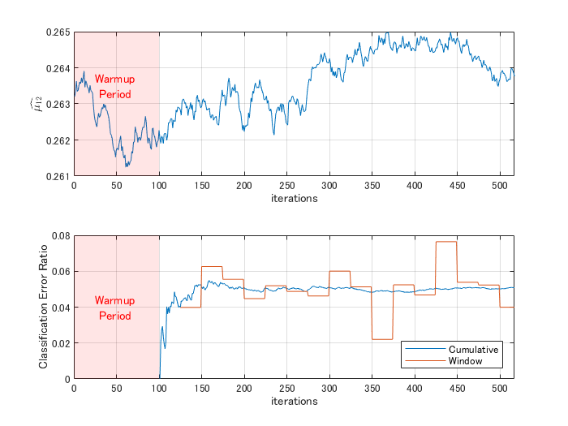

# Human Activity Classification in Simulink® with Updating AI Model using Incremental Learning


This example introduces how to implement incremental learning (also known as online learning) provided by Statistics and Machine Learning Toolbox™ on Simulink model. Concretely, running this script, it creates an incremental classifier for a dataset whose each row contains 60 feature variables and categorical response value being associated with 5 physical activity by acquired acceleration sensors on a smart phone. In addition, it runs the `ClassifyHumanActivityByIncrementalLearning.slx `model implemented the [`MATLAB® System`](https://www.mathworks.com/help/simulink/slref/matlabsystem.html) block to invoke the updatable classifier.

Copyright (c) 2022, The MathWorks, Inc.

# 1. Import dataset from a CSV file

```matlab:Code
DataTableAll = readtable('HumanActivityDataset.csv');
```


Convert data type of `Activities` column to categorical array and check its frequency 


```matlab:Code
DataTableAll.Activities = categorical(DataTableAll.Activities, {'Sitting', 'Standing', 'Walking', 'Running', 'Dancing'});
summary(DataTableAll.Activities)
```


```text:Output
     Sitting       5078 
     Standing      5345 
     Walking       4574 
     Running       3453 
     Dancing       2258 
```

## Convert data type except numerical taking account of importing into Simulink

```matlab:Code
DataTableAll.Activities = double(DataTableAll.Activities);
```

# 2. Partition imported dataset into 2 groups

```matlab:Code
rng(1) % reset the random number generator for reproducibility
cvp = cvpartition(height(DataTableAll), Holdout = 0.5);
disp(cvp)
```


```text:Output
Hold-out の交差検証の区分
   NumObservations: 20708
       NumTestSets: 1
         TrainSize: 10354
          TestSize: 10354
```


```matlab:Code
DataTable1 = DataTableAll(training(cvp),:); % for pre-trained model as initialization
DataTable2 = DataTableAll(test(cvp),:); % for relearning i.e. incremental learning
```

# 3. Create a pre-trained classifier by naive Bayes model as initialization


Let's select multiclass naive Bayes model here, which is one of supporting incremental learning. 


```matlab:Code
initNbMdl = fitcnb(DataTable1, "Activities");
```


"Activities" specified as the 2nd input argument is column name corresponding to the response variable. The `fitcnb` adopts a normal distribution as default probability model for each predictor if it's numerical array. Otherwise, that's categorical array, this function does a multinomial distribution as default.


## Compute confusion matrix to check the classification accuracy of the pre-trained model for training dataset

```matlab:Code
ConfMat1 = confusionmat(DataTable1.Activities, predict(initNbMdl, DataTable1(:,1:end-1)));
disp(ConfMat1)
```


```text:Output
        2554           0           3           0           0
           4        2700          12           0           1
           0          11        2253           3           6
           0           0          12        1304         365
           0           0           4          71        1051
```


```matlab:Code
disp(['Accuracy = ', num2str(100 * sum(diag(ConfMat1)) / sum(ConfMat1,'all')), ' %'])
```


```text:Output
Accuracy = 95.2482 %
```

# 4. Convert the ClassificationNaiveBayes class to incrementalClassificationNaiveBayes class

```matlab:Code
IncrNbMdl = incrementalLearner(initNbMdl, MetricsWarmupPeriod = 2000, MetricsWindowSize = 500, Metrics = "classiferror");
```


See [this page](https://www.mathworks.com/help/stats/classificationnaivebayes.incrementallearner.html) about the syntax of `incrementalLearner` in details.


# 5. Partition the `DataTable2` into a certain amount of data chunks

```matlab:Code
DataTable2 = DataTable2(randperm(height(DataTable2)),:); % shuffle rows in DataTable2
```


Here, the `DataTable2` contains 10354 observation records and we update the pre-trained classifier with fitting each chunk consisting of 20 records as learning data iteratively. Therefore, we run incremental learning `floor`(10354÷20)=517 times iteratively. 


```matlab:Code
NumRecords = height(DataTable2); % be equal to 10354
ChunkSize = 20;
NumChunks = floor(NumRecords/ChunkSize);
```


Pre-allocate variables for the predicted activities, metircs of classification error and the  e.g. estimated mean for instance of the 1st predictor (TotalAccXMean) in class 2 (Standing). 


```matlab:Code
YHatMatirx = zeros(NumChunks, ChunkSize);
ErrorRateTable = table('Size', [NumChunks,2], 'VariableTypes', {'double', 'double'}, 'VariableNames', {'Cumulative', 'Window'}); 
mu12 = zeros(NumChunks,1);
```

# 6. Run the naive Bayes incremental learning on MATLAB 

```matlab:Code
idx = 1;
for n = 1:NumChunks
    YHatMatirx(n,:) = transpose(predict(IncrNbMdl, DataTable2{idx:idx+ChunkSize-1,1:end-1}));
    IncrNbMdl = updateMetricsAndFit(IncrNbMdl, DataTable2{idx:idx+ChunkSize-1,1:end-1}, ...
                            DataTable2.Activities(idx:idx+ChunkSize-1));
    ErrorRateTable{n,:} = IncrNbMdl.Metrics{"ClassificationError",:};
    mu12(n) = IncrNbMdl.DistributionParameters{1,2}(1);
    idx = idx + ChunkSize;
end
```

## Visualize the progress of incremental learning using historical data retrieved at each iteration 

```matlab:Code
figure; tiledlayout(2,1);
axHmu = nexttile; plot(1:NumChunks, mu12); YLimMax = axHmu.YLim(2);
% xline(IncrNbMdl.MetricsWarmupPeriod/ChunkSize, Color = [0.4940 0.1840 0.5560], LineStyle = '-.', LineWidth = 2);
hold(axHmu,"on")
fill([0,repmat(IncrNbMdl.MetricsWarmupPeriod/ChunkSize,1,2),0], ...
    [repmat(axHmu.YLim(1),1,2), repmat(axHmu.YLim(2),1,2)], 'r', FaceAlpha = 0.1, LineStyle = 'none');
text(0.25*IncrNbMdl.MetricsWarmupPeriod/ChunkSize, mean(axHmu.YLim), 'Warmup \newline Period', Color = 'r');
xlabel('iterations'); ylabel('$\widehat{\mu_{12}}$', Interpreter = 'latex'); xlim([0, NumChunks]); grid(axHmu,"on");
hold(axHmu,"off"); axHmu.YLim(2) = YLimMax;

axHerr = nexttile; plot(1:NumChunks, ErrorRateTable.Variables);
% xline(IncrNbMdl.MetricsWarmupPeriod/ChunkSize, Color = [0.4940 0.1840 0.5560], LineStyle = '-.', LineWidth = 2);
hold(axHerr,"on")
fill([0,repmat(IncrNbMdl.MetricsWarmupPeriod/ChunkSize,1,2),0], ...
    [repmat(axHerr.YLim(1),1,2), repmat(axHerr.YLim(2),1,2)], 'r', FaceAlpha = 0.1, LineStyle = 'none');
text(0.25*IncrNbMdl.MetricsWarmupPeriod/ChunkSize, mean(axHerr.YLim), 'Warmup \newline Period', Color = 'r');
xlabel('iterations'); ylabel('Classification Error Ratio'); xlim([0, NumChunks]); grid(axHerr,"on");
legend(ErrorRateTable.Properties.VariableNames, Location = 'southeast'); 
hold(axHerr,"off")
```




# 7. Run the equivalent incremental learning on Simulink


MathWorks provides specialized objects in MATLAB and many toolboxes, called as [System Object™](https://www.mathworks.com/help/matlab/matlab_prog/what-are-system-objects.html), which is designed for implementing and simulating dynamic systems with inputs that change over time. This object goes very well together with streaming data processing for a certain amount of data chunk recursively. In addition, `MATLAB System` block is provided to implement custom System Object on Simulink model and  DSP System Toolbox™ provides useful block library to control data flow in Simulink.  


## Prepare data for incremental learning on Simulink model


The [Signal From Workspace](https://www.mathworks.com/help/dsp/ref/signalfromworkspace.html) block provided by DSP System Toolbox is more useful than standard [From Workspace](https://www.mathworks.com/help/simulink/slref/fromworkspace.html) block or [Inport](https://www.mathworks.com/help/simulink/slref/inport.html) block in case of simulation with incremental learning. Assign the predictors corresponding to from the 1st column to the 60th column in the `DataTable2` to `PredictorsSignal` and the response corresponding to the Activities column to `ResponseSignal` as workspace variable respectively because this block requires numerical array to import variables on MATLAB workspace into Simulink.


```matlab:Code
PredictorsSignal = DataTable2{1:ChunkSize*NumChunks,1:end-1};
ResponseSignal   = DataTable2.Activities(1:ChunkSize*NumChunks);
```


Where appearing in the above, the ChunkSize*NumChunks (= 10340) is the number of total records to import into Simulink model. Let's leave the time configuration up to specified parameters in the Solver pane in the Model Configuration Parameters as follows;


   -  Start Time =` 1;`   
   -  Stop Time =` 10340;` % = ChunkSize*NumChunks 
   -  (Solver) Type = `'Fixed-step'` 
   -  Fixed step size (Δt) = 1 (auto) 

## Launch and run the `ClassifyHumanActivityByIncrementalLearning` model

```matlab:Code
slMdl  = 'ClassifyHumanActivityByIncrementalLearning';
open_system(slMdl)
simout = sim(slMdl);
```


# 8. Verify the consistency between MATLAB execution and Simulink simulation

```matlab:Code
YHatSimAll = transpose(squeeze(simout.yHat.Data));
YHatSim = YHatSimAll(1:20:end,:);
YHatSim(1,:) = []; % remove the 1st row corresponding to the initial value
isequal(YHatMatirx, YHatSim)
```


```text:Output
ans = 
   1

```


```matlab:Code
ErrorRateSimAll = transpose(squeeze(simout.ScopeData1.signals.values));
ErrorRateSim = ErrorRateSimAll(1:20:end,:);
ErrorRateSim(1,:) = []; % remove the 1st row corresponding to the initial value
isequal(ErrorRateTable.Cumulative(~isnan(ErrorRateTable.Cumulative)), ErrorRateSim(~isnan(ErrorRateSim(:,1)),1))
```


```text:Output
ans = 
   1

```


```matlab:Code
isequal(ErrorRateTable.Window(~isnan(ErrorRateTable.Window)), ErrorRateSim(~isnan(ErrorRateSim(:,2)),2))
```


```text:Output
ans = 
   1

```

