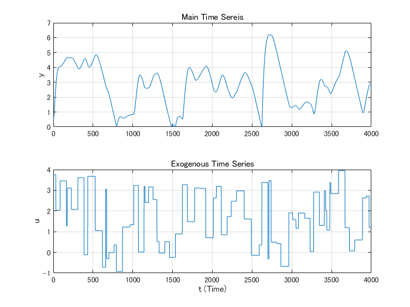
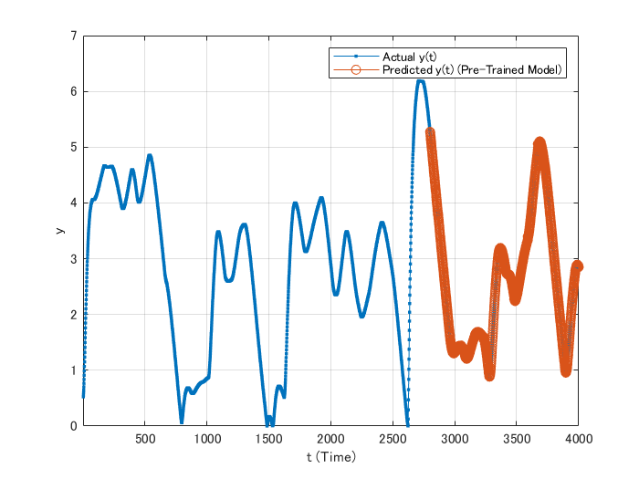
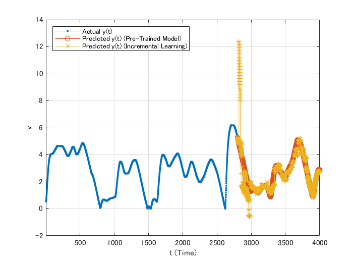
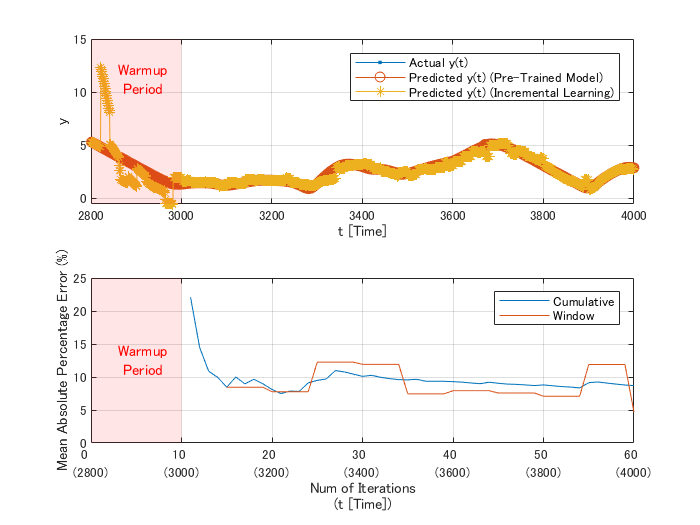
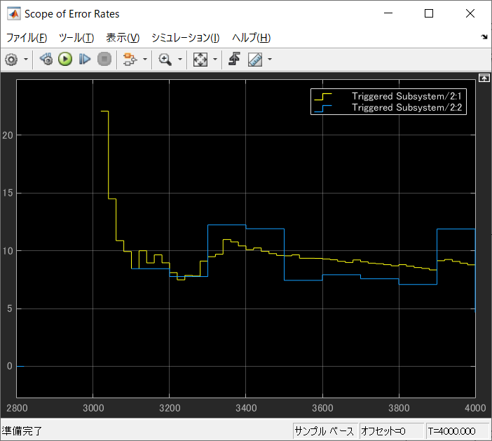

# Time Series Regression in Simulink® with Updating AI Model using the Incremental Learning 


This example introduces how to implement incremental learning (also known as online learning) provided by Statistics and Machine Learning Toolbox™ on Simulink model. Concretely, after fitting a partial time series data in a CSV file to the following non-linear ARX model expressed by support vector machine, we update this pre-trained model using chunk of data divided the remained data into more than one thousand  groups recursively.


> , 


This example offers not only Simulink model implemented incremental learning on but equivalent MATLAB® code.

Copyright (c) 2022, The MathWorks, Inc.

# 1. Import time series data from a CSV file

```matlab:Code
DataFileName = 'SampleTimeSeries.csv';
FileObj = detectImportOptions(DataFileName);
```

## Show preview before importing data

```matlab:Code
preview(DataFileName, FileObj)
```

| |y|u|
|:--:|:--:|:--:|
|1|0.5000|3.7506|
|2|0.5064|3.7506|
|3|0.5253|3.7506|
|4|0.5555|3.7506|
|5|0.5960|3.7506|
|6|0.6454|3.7506|
|7|0.7027|3.7506|
|8|0.7666|3.7506|

## Import time series data as table array

```matlab:Code
RawData = readtable(DataFileName,FileObj);
```

## Plot the imported time series

```matlab:Code
t = 1:height(RawData);
figure; tiledlayout(2,1)
nexttile; plot(t,RawData.y);
xlim([0, t(end)]);
grid("on"); ylabel("y");
title("Main Time Sereis")
nexttile; plot(t,RawData.u);
xlim([0, t(end)]);
grid("on"); ylabel("u"); xlabel("t (Time)")
title("Exogenous Time Series")
```




# 2. Divide imported time series into 2 groups
## Partition the imported raw data into each timeline

```matlab:Code
NumVariables = 6;
DataAll = table('Size', [height(RawData)-2, NumVariables], 'VariableTypes', repmat({'double'},1,NumVariables), ...
    'VariableNames', {'y(t-1)', 'y(t-2)', 'u(t)', 'u(t-1)', 'u(t-2)',  'y(t)'});

DataAll.("y(t)")   = RawData.y(3:end);
DataAll.("y(t-1)") = RawData.y(2:end-1);
DataAll.("y(t-2)") = RawData.y(1:end-2);
DataAll.("u(t)")   = RawData.u(3:end);
DataAll.("u(t-1)") = RawData.u(2:end-1);
DataAll.("u(t-2)") = RawData.u(1:end-2);
```

## Divide the partitioned dataset into 2 groups for training and testing

```matlab:Code
NumTrainData = floor(height(DataAll)*0.7);
DataTable1   = DataAll(1:NumTrainData,:);
DataTable2   = DataAll(NumTrainData+1:end,:);
```

# 3. Create a pre-trained model by SVM as initialization

```matlab:Code
initSVMMdl = fitrkernel(DataTable1, 'y(t)', ...
    KernelScale = 6.9904, ...
    Lambda = 3.6385e-7, ...
    Epsilon = 0.0341);
```


*Caution : As of R2022a, the only supported kernel function is "linear" when you choose not *`fitrkernel`* but *`fitrsvm`* to apply incremental learning.*


## Check the prediction accuracy of the pre-trained model by the mean absolute percentage error

```matlab:Code
disp(['Mean Absolute Percentage Error (Training Data) = ', num2str(loss(initSVMMdl, DataTable1, "y(t)", 'LossFun', @mylossfun)), ' %'])
```


```text:Output
Mean Absolute Percentage Error (Training Data) = 4.243 %
```


```matlab:Code
disp(['Mean Absolute Percentage Error (Test Data) = ', num2str(loss(initSVMMdl, DataTable2, "y(t)", 'LossFun', @mylossfun)), ' %'])
```


```text:Output
Mean Absolute Percentage Error (Test Data) = 0.9538 %
```

## Plot actual and predicted time series in the sake of comparison visually using test data

```matlab:Code
yhatP = predict(initSVMMdl, DataTable2(:,1:end-1));

figure; plot(t(3:end), DataAll.("y(t)"),'Marker','.');
grid("on"); hold("on");
plot(t(NumTrainData+2:end),[DataTable1.("y(t)")(end); yhatP],"Marker","o")
xlim([t(1), t(end)]);
legend(["Actual y(t)", "Predicted y(t) (Pre-Trained Model)"]);
hold("off")
xlabel('t (Time)'); ylabel('y')
```




# 4. Convert the RegressionKernel class to incrementalRegressionKernel class

```matlab:Code
IncrSVMMdl = incrementalLearner(initSVMMdl, MetricsWarmupPeriod = 200, MetricsWindowSize = 100, Metrics = @aer);
```

# 5. Partition the `DataTable2` into a certain amount of data chunks


Here, the `DataTable2` contains 1200 observation records and we update the pre-trained regressor with fitting each chunk consisting of 20 records as learning data iteratively. Therefore, we run incremental learning `floor`(1200÷20)=60 times iteratively. Though partitioned each data chunk as 20 samples here, the size of samples can be changed to any positive integer. 


```matlab:Code
NumRecords = height(DataTable2); % be equal to 1200
ChunkSize = 20;
NumChunks = floor(NumRecords/ChunkSize);
DataTable2c = cell(NumChunks, 2);
idx = 1;
for n = 1:NumChunks
    DataTable2c{n,1} = DataTable2{idx:idx+ChunkSize-1,1:end-1};
    DataTable2c{n,2} = DataTable2.("y(t)")(idx:idx+ChunkSize-1);
    idx = idx + ChunkSize;
end
```

# 6. Run the SVM incremenral learning on MATLAB

```matlab:Code
% initialize variables to store the results of incremental learning
EILTable   = table('Size', [NumChunks,2], 'VariableTypes', {'double', 'double'}, 'VariableNames', {'Cumulative', 'Window'});
ErrTable   = table('Size', [NumChunks,2], 'VariableTypes', {'double', 'double'}, 'VariableNames', {'Cumulative', 'Window'}); 
YHatMatirx = zeros(NumChunks, ChunkSize);

rng(0); % initialize the random number generator for reproducibility
% run incremenral learning
for n = 1:NumChunks
    YHatMatirx(n,:) = transpose(predict(IncrSVMMdl, DataTable2c{n,1})); % predict values in the current period  
    IncrSVMMdl = updateMetricsAndFit(IncrSVMMdl, DataTable2c{n,1}, DataTable2c{n,2}); % update the regressor
    EILTable{n,:} = IncrSVMMdl.Metrics{"EpsilonInsensitiveLoss",:};
    ErrTable{n,:} = 100.*IncrSVMMdl.Metrics{"aer",:};
end
```

## Plot the result of prediction by incremental learning model together with actual time series and predicted values by the pre-trained model

```matlab:Code
yhatI = reshape(YHatMatirx', numel(YHatMatirx),1);

figure; plot(t(3:end), DataAll.("y(t)"),'Marker','.');
grid("on"); hold("on");
plot(t(NumTrainData+2:end),[DataTable1.("y(t)")(end); yhatP],"Marker","o")
plot(t(NumTrainData+2:end),[DataTable1.("y(t)")(end); yhatI],"Marker","*")

xlim([t(1), t(end)]);
legend(["Actual y(t)", "Predicted y(t) (Pre-Trained Model)", "Predicted y(t) (Incremental Learning)"], Location = "northwest");
hold("off")
xlabel('t (Time)'); ylabel('y')
```




## Zoom in on the posterior part corresponding to the test data and plot the MAPE of incremental learning

```matlab:Code
figure; tiledlayout(2,1)
axHts = nexttile; plot(t(NumTrainData+2:end), DataAll.("y(t)")(NumTrainData:end), Marker = '.');
grid(axHts,"on"); hold(axHts,"on");
plot(t(NumTrainData+2:end),[DataTable1.("y(t)")(end); yhatP], Marker = 'o');
plot(t(NumTrainData+2:end),[DataTable1.("y(t)")(end); yhatI], Marker = '*');
xlim([t(NumTrainData+1), t(end)]);
legend(["Actual y(t)", "Predicted y(t) (Pre-Trained Model)", "Predicted y(t) (Incremental Learning)"], Location = "northeast"');
fill([0,repmat(axHts.XLim(1)+IncrSVMMdl.MetricsWarmupPeriod,1,2),0], ...
    [repmat(axHts.YLim(1),1,2), repmat(axHts.YLim(2),1,2)], 'r', FaceAlpha = 0.1, LineStyle = 'none',  HandleVisibility ='off');
text(axHts.XLim(1)+0.3*IncrSVMMdl.MetricsWarmupPeriod, 0.75*axHts.YLim(2), 'Warmup \newline Period', Color = 'r');
hold(axHts,"off")
xlabel('t [Time]'); ylabel('y')

axHer = nexttile;
plot(1:NumChunks, ErrTable.Variables');
grid(axHer,"on"); hold(axHer, "on")
fill([0,repmat(IncrSVMMdl.MetricsWarmupPeriod/ChunkSize,1,2),0], [0,0,repmat(axHer.YLim(2),1,2)] , 'r', FaceAlpha = 0.1, LineStyle = 'none');
text(3, mean(axHer.YLim), 'Warmup \newline Period', Color = 'r');
ylabel('Mean Absolute Percentage Error (%)'); xlim([0, NumChunks]); 
legend(ErrTable.Properties.VariableNames, Location = 'northeast');
xticklabels(join([join(["  " + string(transpose(0:10:NumChunks)), repmat("newline",7,1)], "\"), string(transpose(axHts.XLim(1):200:axHts.XLim(2)))], "(") + ")");
xlabel({'Num of Iterations'; '(t [Time])'}, HorizontalAlignment='center')
hold(axHer,"off")
```




# 7. Run the equivalent incremenral learning on Simulink


MathWorks provides specialized objects in MATLAB and many toolboxes, called as [System Object™](https://www.mathworks.com/help/matlab/matlab_prog/what-are-system-objects.html), which is designed for implementing and simulating dynamic systems with inputs that change over time. This object goes very well together with streaming data processing for a certain amount of data chunks recursively. In addition, `MATLAB System` block is provided to implement custom System Object on Simulink model and DSP System Toolbox™ provides useful block library to control data flow in Simulink.


## Prepare data for incremental learning on Simulink model

```matlab:Code
PredictorsSignal = DataTable2{1:ChunkSize*NumChunks,1:end-1};
ResponseSignal   = DataTable2.("y(t)")(1:ChunkSize*NumChunks);
```


Where appearing in the above, the ChunkSize*NumChunks (= 1200) is the number of total records to import into Simulink model. Let's leave the time configuration up to specified parameters in the Solver pane in the Model Configuration Parameters as follows;


   -  Start Time =` 2800;`   
   -  Stop Time =` 4000;` % = StartTime + ChunkSize*NumChunks 
   -  (Solver) Type = `'Fixed-step'` 
   -  Fixed step size (Δt) = 1 (auto) 

## Launch and run the `PredictTimeSeriesByIncrementalLearning` model

```matlab:Code
slMdl = 'PredictTimeSeriesByIncrementalLearning';
open_system(slMdl)

set_param(slMdl,'SimulationCommand','start')
rng(0); % initialize the random number generator for reproducibility
while strcmp(get_param(slMdl,"SimulationStatus"), 'running')
    pause(3) % block to proceed until terminating simulation
end
```





# 8. Verify the consistency of prediction between MATLAB execution and Simulink simulation
## Compare predicted values over the posterior part corresponding to the test data

```matlab:Code
YHatSimAll = transpose(squeeze(out.yHat.Data));
YHatSim = YHatSimAll(1:20:end,:);
YHatSim(1,:) = [];
isequal(YHatMatirx, YHatSim)
```


```text:Output
ans = 
   1

```

## Compare the both performance metrics using the MAPE over the posterior part

```matlab:Code
ErrorRateSimAll = transpose(squeeze(out.ScopeData1.signals.values));
ErrorRateSim = ErrorRateSimAll(1:20:end,:);
ErrorRateSim(1,:) = [];
isequal(ErrTable.Cumulative(~isnan(ErrTable.Cumulative)), ErrorRateSim(~isnan(ErrorRateSim(:,1)),1))
```


```text:Output
ans = 
   1

```


```matlab:Code
isequal(ErrTable.Window(~isnan(ErrTable.Window)), ErrorRateSim(~isnan(ErrorRateSim(:,2)),2))
```


```text:Output
ans = 
   1

```

## Appendix. Helper function to compute the Mean Absolute Percentage Error in order to measure prediction accuracy

```matlab:Code
function mape = mylossfun(Y,YHat,~)
% Compute the Mean Absolute Percentage Error
% 

mape = 100 .* sum(aer(Y,YHat))./numel(Y);

end
```

